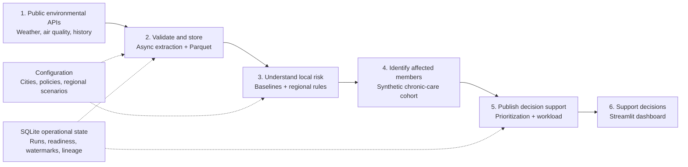
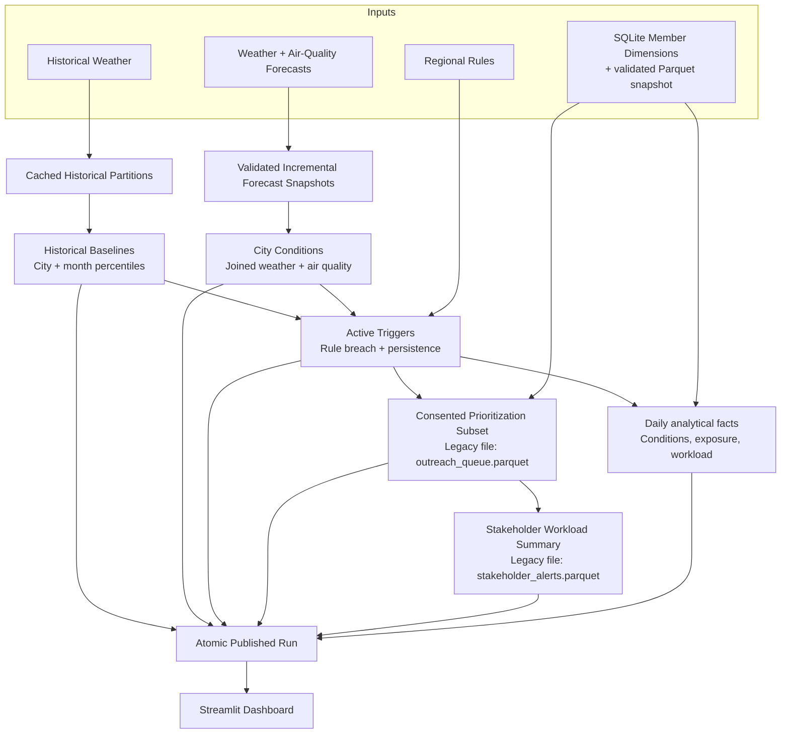
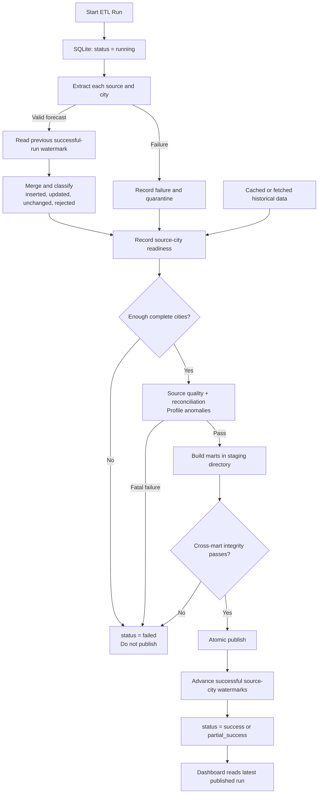

# CareSignal India Architecture

This document describes the architecture implemented in the repository today. The system identifies
potential member exposure and care-operations review workload; it does not contact members.

## Architecture At A Glance

Read this diagram left to right. It answers one question: **how does public environmental data become an
reviewable care-operations workload?**

### What Each Step Means

| Step | What happens |
|---|---|
| 1. Public data | Open-Meteo provides forecasts; NASA POWER provides five complete historical years |
| 2. Validate and store | Source contracts validate responses; DuckDB merges forecast corrections; manifested Parquet stores reusable run snapshots |
| 3. Understand risk | Historical percentiles and region-specific rules identify sustained environmental events |
| 4. Identify members | Triggered cities and relevant chronic conditions are joined to synthetic members; consent remains a separate governance attribute |
| 5. Publish decision support | Quality-approved prioritization and workload datasets are atomically published |
| 6. Support decisions | Streamlit shows affected-member insights and pipeline health from retained published runs |

## Data Processing Architecture

Read this diagram top to bottom. It shows the datasets created during a successful pipeline run. Operational
metadata and failure handling are deliberately excluded here and shown in the next diagram.

### Published Data Products

| Data product | Purpose |
|---|---|
| `historical_baselines.parquet` | Defines what is locally unusual for each city and month |
| `city_conditions.parquet` | Creates one combined environmental view per city and forecast hour |
| `active_triggers.parquet` | Contains persisted rule breaches classified as today's actions or upcoming risks |
| `environmental_conditions_daily.parquet` | Expands trigger windows to a date, city, and condition grain |
| `environmental_metrics_daily.parquet` | Compares selected-date environmental metrics with local history |
| `member_risk_exposure_daily.parquet` | Identifies potentially at-risk members and records consent-aware prioritization |
| `care_workload_daily.parquet` | Summarizes at-risk, consented, and high-priority members by date and city |
| `outreach_queue.parquet` | Legacy internal name for consented members prioritized for stakeholder review |
| `stakeholder_alerts.parquet` | Legacy internal name for aggregated stakeholder review workload |

## Pipeline Control Architecture

This diagram explains whether a run is allowed to publish and how SQLite drives incremental behavior.

### Storage Responsibilities

| Storage | Stores | Why it is used |
|---|---|---|
| Parquet `data/raw/` | Forecast snapshots and historical source data | Columnar, compressed, and queryable directly by DuckDB |
| Parquet `data/reference/` | Versioned compiled rules and validated member snapshots | Reusable, immutable analytical inputs for DuckDB |
| Parquet `data/processed/` | Immutable published analytical runs | Dashboard never reads partially built output |
| Parquet `data/analytical_history/` | Lightweight immutable daily fact snapshots retained independently of processed runs | Historical date selection without API calls |
| SQLite `data/metadata/pipeline.db` | Normalized runs and metrics, unified source execution/state, artifact lineage, quality evidence, reference operations, and member dimensions | Transactional operational control plane and member system of record |
| Quarantine in SQLite | Invalid source-city events and payload context | Makes failures visible without storing generated data in Git |

## Current Data Contracts

| Layer | Dataset or state | Natural key or version boundary |
|---|---|---|
| Forecast raw | Retryable city snapshots plus compacted source-run analytical artifacts | `source + city_id + observed_at`, partitioned by `run_id` |
| Historical raw | NASA POWER daily records | `city_id + observed_date`, partitioned by baseline year, city, and year |
| Regional rule reference | Definitions, predicates, and relevant conditions | Deterministic `ruleset_version` |
| Member operational dimensions | Current synthetic members and member-condition bridge | SQLite primary and foreign keys |
| Member analytical snapshot | City-partitioned members and conditions plus manifest | Deterministic `member_snapshot_id` |
| Publication scope | Complete cities eligible for a run | `run_id + city_id` |
| Active trigger | Sustained rule breach | `ruleset_version + rule_id + city_id + window_start` |
| Prioritization subset | Consent-aware member-rule review candidate | `member_id + rule_id + window_start` |
| Operational state | Runs, readiness, watermarks, rejects, and lineage | SQLite-managed keys defined in migrations |

## Component Review Sequence

We will review and optimize components in this order because each stage defines the contract required by the
next stage:

1. **Configuration and domain model**: supported cities, scenario catalog, thresholds, persistence windows,
   publication policy, and correction lookback.
2. **API clients and schema validation**: concurrency, retries, timeouts, response parsing, validation, and
   source-specific failure handling.
3. **Incremental raw storage**: watermark semantics, correction overlap, deduplication, snapshot merge,
   partitioning, compression, and retention.
4. **Historical baselines**: cache lifecycle, baseline periods, percentile methodology, and refresh strategy.
5. **Quality, readiness, and quarantine**: source checks, invalid records, success and partial-success policy,
   and publication eligibility.
6. **Regional rule engine**: compiled rule model, compound predicates, historical thresholds, and persistence
   evaluation.
7. **Care-operations marts**: city conditions, triggers, consent-aware prioritization, stakeholder aggregation, and
   product usefulness.
8. **Publication and metadata**: staging, atomic publication, lineage, watermarks, migrations, and failure
   semantics.
9. **Dashboard read layer**: predicate-pushed SQL access, historical date resolution, KPIs, filters, trends,
   workload views, and pipeline-health evidence.
10. **Production evolution**: installed scheduling, deeper recovery automation, external monitoring,
    notifications, security, and access control.

## Current Boundaries

### Implemented

- Manual end-to-end ETL execution
- Async API calls with retries, timeouts, and bounded concurrency
- Schema validation and source-city failure quarantine
- Watermark-driven incremental forecast snapshots
- Schema-governed raw manifests, abandoned-staging recovery, and source-level Parquet compaction
- Parquet and DuckDB analytical processing
- Config-driven regional and compound rules
- Historical percentile baselines
- Quality and readiness gates with partial publication
- Overlap-protected execution and component-level duration and row-flow metrics
- Atomic publication, lineage, retention, and SQLite operational metadata
- Streamlit dashboard for product outputs and pipeline health

### Deliberately Deferred

- Installed scheduler
- Automatic abandoned-run recovery and backfill commands
- External monitoring, alert routing, and notifications
- Production authentication, authorization, and member-level access controls
