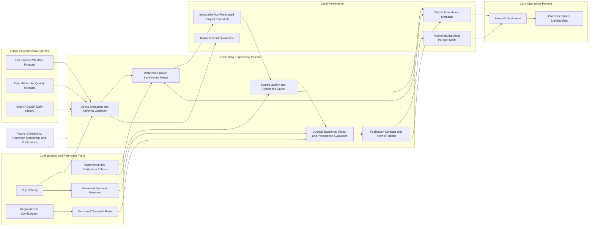
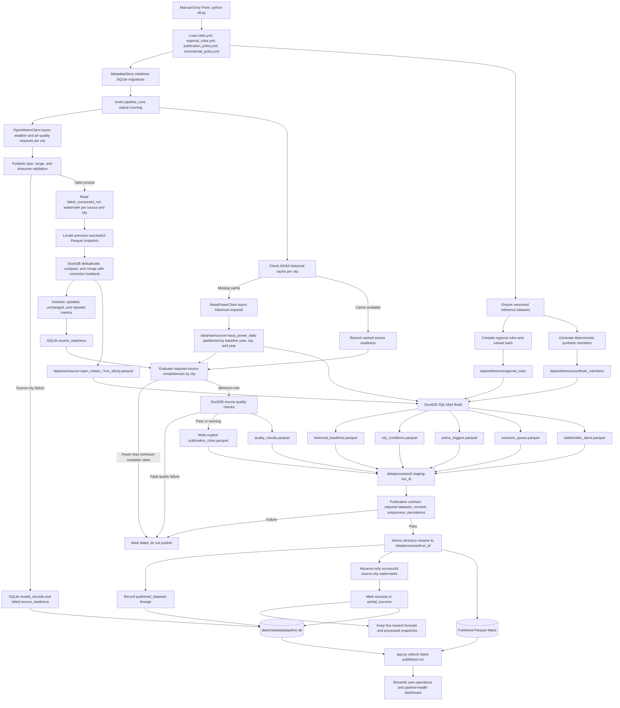

# CareSignal India Architecture

This document describes the architecture implemented in the repository today. Scheduling, automated recovery,
external monitoring, notifications, and dashboard redesign are intentionally shown as future work rather than
current capabilities.

## High-Level Architecture

### High-Level Responsibilities

| Area | Current responsibility |
|---|---|
| Public sources | Provide seven-day weather and air-quality forecasts plus five complete years of historical weather |
| Configuration and reference plane | Defines supported cities, regional scenarios, publication thresholds, correction lookback, compiled rules, and synthetic members |
| Pipeline | Extracts concurrently, validates schemas, merges rolling snapshots, evaluates readiness, builds analytical marts, and publishes atomically |
| Parquet | Stores memory-efficient source snapshots, reusable references, historical partitions, and immutable published marts |
| SQLite | Drives pipeline state through run lifecycle, source readiness, watermarks, invalid records, incremental metrics, and publication lineage |
| Streamlit | Reads only the latest successfully published run and exposes care-operations outputs plus pipeline-health information |

## Low-Level Architecture

## Current Data Contracts

| Layer | Dataset or state | Natural key or version boundary |
|---|---|---|
| Forecast raw | Weather and air-quality city snapshots | `source + city_id + observed_at`, partitioned by `run_id` |
| Historical raw | NASA POWER daily records | `city_id + observed_date`, partitioned by baseline year, city, and year |
| Regional rule reference | Definitions, predicates, and relevant conditions | Deterministic `ruleset_version` |
| Synthetic member reference | Members and member conditions | Deterministic generator and city-set version |
| Publication scope | Complete cities eligible for a run | `run_id + city_id` |
| Active trigger | Sustained rule breach | `ruleset_version + rule_id + city_id + window_start` |
| Outreach queue | Consent-aware member-rule action | `member_id + rule_id + window_start` |
| Operational state | Runs, readiness, watermarks, rejects, and lineage | SQLite-managed keys defined in migrations |

## Component Review Sequence

We will review and optimize components in this order because each stage defines the contract required by the
next stage:

1. **Configuration and domain model**: supported cities, scenario catalog, thresholds, persistence windows,
   publication policy, and correction lookback.
2. **API clients and schema validation**: concurrency, retries, timeouts, response parsing, validation, and
   source-specific failure handling.
3. **Incremental raw storage**: watermark semantics, correction overlap, deduplication, snapshot merge,
   partitioning, compression, and retention.
4. **Historical baselines**: cache lifecycle, baseline periods, percentile methodology, and refresh strategy.
5. **Quality, readiness, and quarantine**: source checks, invalid records, success and partial-success policy,
   and publication eligibility.
6. **Regional rule engine**: compiled rule model, compound predicates, historical thresholds, and persistence
   evaluation.
7. **Care-operations marts**: city conditions, triggers, consent-aware outreach, stakeholder aggregation, and
   product usefulness.
8. **Publication and metadata**: staging, atomic publication, lineage, watermarks, migrations, and failure
   semantics.
9. **Dashboard read layer**: current SQL access pattern and existing KPIs. Full KPI and design redesign happens
   only after the preceding components are finalized.
10. **Later operational phase**: scheduling, recovery, monitoring, notifications, and expanded runbook
    documentation.

## Current Boundaries

### Implemented

- Manual end-to-end ETL execution
- Async API calls with retries, timeouts, and bounded concurrency
- Schema validation and source-city failure quarantine
- Watermark-driven incremental forecast snapshots
- Parquet and DuckDB analytical processing
- Config-driven regional and compound rules
- Historical percentile baselines
- Quality and readiness gates with partial publication
- Atomic publication, lineage, retention, and SQLite operational metadata
- Streamlit dashboard for product outputs and pipeline health

### Deliberately Deferred

- Installed scheduler and overlap locking
- Automatic abandoned-run recovery and backfill commands
- External monitoring, alert routing, and notifications
- Dashboard KPI and visual redesign
- Full operational runbook and deployment architecture
